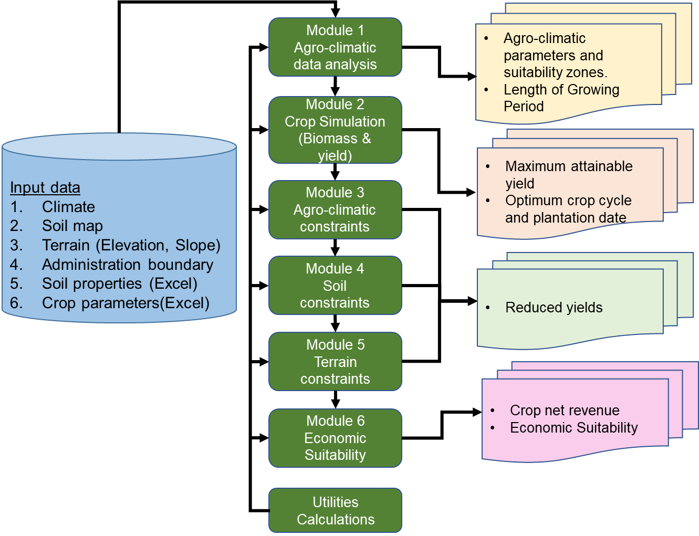

# About

## Introduction

The world population is expected to reach 8.5 billion in 2030 and 9.7 billion in 2050 (UN DESA, 2022). With this eruptive growth in population, an unprecedented increase in demand for food, feed, and fuel is expected, while the agricultural land needed for production continues to shrink in many parts of the world.
The accelerating pace of climate change, combined with global population growth, threatens food security globally. Higher temperatures eventually reduce yields of desirable crops while encouraging weed and pest proliferation and changes in precipitation patterns increase the likelihood of short-run crop failures and long-run production declines (Nelson et al., 2009).

Yield increases on existing croplands will, therefore, be an essential component to increase food production (Ray et al., 2013). To this end, the Agro-Ecological Zoning (AEZ) framework was developed as a tool to analyse the effect of climate on land use and agricultures, as well as helping to optimise the crop cycle to produce the best yield possible. PyAEZ is an open-source Python package which offers AEZ calculations for user to implement for their regional AEZ analyses. This technical document contains detailed descriptions of all the AEZ modules and functions in PyAEZ.

## Background

Over the last thirty years, FAO and the International Institute for Applied Systems Analysis
(IIASA) have been developing Agro-Ecological Zoning (AEZ). AEZ is a modelling system for land evaluation to support sustainable land use planning, stimulate agricultural investments, monitor the status of agricultural resources, and assess the impacts of climate change on agriculture.

The Agro-Ecological Zoning (AEZ) approach, developed by FAO jointly with IIASA, is based on the principles of land evaluation and defines matching procedures to identify crop-specific limitations of prevailing climate, soil, and terrain resources with simple and robust crop models, under assumed levels of inputs and management conditions. Main outputs are maximum potential and agronomically attainable crop yields and suitability levels for basic land resources units under different agricultural production systems defined by water supply systems and levels of inputs and management circumstances. While most countries have adopted land evaluation, land suitability assessment, agro-ecological zoning in the past to prepare agricultural investment plans, most of those are outdated. In parallel, various generations of “AEZ Projects” have served as vehicles to consolidate efforts, structure project goals, and promote funding and resources for the further development of these concepts. And while new datasets and technologies are increasingly becoming available, national capacities to develop, update and use agro-ecological zoning remain limited. The GAEZ assessment, currently at its fourth update (GAEZ v4), uses seven different modules that are run sequentially to generate agro-climatic and crop-specific information. Each module is made up of a series of FORTRAN routines, documented in GAEZ version 4 model documentation (Fischer et al., 2021), that are run through custom batch scripts. Additional scripts in Delphi are used for specific modelling (to be clearly specified by IIASA). Data preparation, although fully documented on the theoretical concepts, is mostly undocumented when addressing the required process to input new data in the modelling system. Limited knowledge on data preparation and lack of a systematic system to run FORTRAN routines make the capacity to generate outputs, limited to a restricted number of experts at IIASA.

The main strategic shift of GAEZ v5 is to focus on how the strong scientific basis for GAEZ can be made available to national entities to support decision-making. GAEZ v5 will focus on taking the last three decades of knowledge and building a standardized, repeatable, accessible yet extensible approach for countries to implement their own, fit for purpose, nationally-adjusted Agro-Ecological Zoning project(s). Countries need guidance on how to collect relevant local data, what tools they can use to create data if it does not exist, how to engage with farmers, local representatives and other stakeholders, and how to process, manage, host and disseminate results of an analysis.

With a growing need to address country-specific Agro-Ecological Zoning modelling, the “Strengthening Agro-climatic Monitoring and Information System (SAMIS) project in Lao PDR,
in collaboration with the Geoinformatics Center of the Asian Institute of Technology (AIT-GIC) developed a first prototype in Python language, named PyAEZ, that generate national AEZ information. The code, with supporting documentation, and training material is publicly available in the [PyAEZ GitHub repository.](https://github.com/gicait/PyAEZ)

!!! note "Additional Information"

    Further information on the Strengthening agro-climatic monitoring and information systems to improve adaptation to climate change and food security in Lao PDR (GCP/LAO/021/LDF) SAMIS project can be found at this [link.](https://www.fao.org/in-action/samis/en/)

## What is PyAEZ?

PyAEZ is the first step of GAEZ expansion that utilizes Python scripts to develop users’AEZ projects. The PyAEZ package utilizes climate, soil, and terrain conditions relevant to agricultural production and suitability using crop-specific land resource inventory parameters.

The package is developed with several Python routines and is operated with Jupyter Notebooks, which means it has the capability to be uploaded onto Google Colab, an online Jupyter Notebook system. This compatibility with an online platform such as Google Colab allowed the development team to host two virtual hands-on trainings where attendants were guided through the scientific concepts of AEZ as well as executing the scripts with country-specific input data, through Google Colab.

PyAEZ has been developed to be used within the tropical region, hence some of the complexity of GAEZ in non-tropical regions (e.g. vernalization requirements, permafrost evaluation) is not accounted for. Moreover, the system has not been tested on larger areas where performances of results may be an issue.

PyAEZ package consists of six main AEZ modules and one additional utility module stated as below:

* Module 1: Climate regime - calculation of agro-climatic indicators for evaluation of climatic suitability of crops.

* **Module 2: Crop simulation** - simulate an optimal crop cycle for the highest attainable yield.
* **Module 3: Climate constraints** - application of agro-climatic constraints to the calculated yield of a particular crop.
* **Module 4: Soil constraints** - application of edaphic constraints to the calculated yield of a particular crop.
* **Module 5: Terrain constraints** - application of terrain constraints to the calculated yield of a particular crop.
* **Module 6: Economic suitability analysis** - evaluation of economic profitability of a crop based on crop price and the calculated yield.
* **Utilities calculations** - miscellaneous calculation routines used throughout the 6 main AEZ.

The package is also equipped with additional calculation routines for:

1. **CropWatCalc** - crop water requirement calculation calculation and applying of yield reduction factors based on water limitation (FAO CropWat algorithm) (Smith, 1992);
2. **BioMassCalc** - biomass calculation produced by photosynthesis activities of plants under given radiation conditions (de Wit, C.T., 1965 );
3. **ETOCalc** - reference evapotranspiration calculation using Penman-Monteith algorithm (Allen et al., 1998; Monteith, 1965, 1981)
4. **LGPCalc** - calculation module concerning with days counting for LGP routine.
5. **ThermalScreening** - lists thermal suitability routine.
