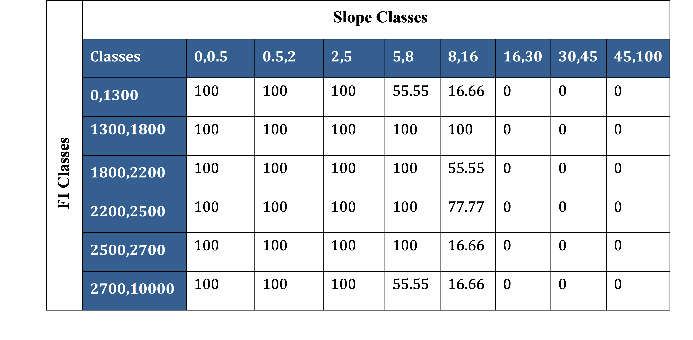

This section will cover all the system and data requirements to run PyAEZ. These subsections also act as an essential checklist for the necessary elements to every PyAEZ project initiation.

## Preparation

### Python Dependencies

PyAEZ package requires the following additional open-source Python packages to be installed and imported for the AEZ calculations to work:

1. NumPy: NumPy array is the format used throughout PyAEZ for pixel-based calculation.
2. GDAL: allow the package to utilize and generate geo-referenced output from non- geocoded NumPy arrays.
3. SciPy: offers statistical analyses and is interoperable with NumPy array.
4. Pandas: allows PyAEZ to read MS Excel sheets with user-defined parameters.
5. Numba: aware optimizing compiler used to speed up some computationally heavy routines within PyAEZ.

!!! note "Additional Information"

    Numpy: https://numpy.org/install/
    
    GDAL : https://anaconda.org/conda-forge/gdal
    
    SciPy : https://scipy.org/install
    
    Pandas : https://pandas.pydata.org/docs/getting_started/install.html
    
    Numba : https://numba.readthedocs.io/en/stable/user/installing.html
    
    Copernicus Climate Data Stores : https://cds.climate.copernicus.eu/
    
    ECMWF : https://www.ecmwf.int/en/forecasts/datasets
    
    Google Earth Engine : https://developers.google.com/earth-engine/datasets

___

### Input Climatic Parameters Preparation

|Climatic Parameter|Data Frequency|Unit|Data Format|
|------------------|--------------|----|-----------|
|Minimum Air Temperature|Daily/Monthly|&#176;C| 3D NumPy Array (row, col, time)|
|Maximum Air Temperature|Daily/Monthly|&#176;C| 3D NumPy Array (row, col, time)|
|Total Precipitation|Daily/Monthly|mm/day| 3D NumPy Array (row, col, time)|
|Solar Radiation|Daily/Monthly|W/m2| 3D NumPy Array (row, col, time)|
|Relative Humidity|Daily/Monthly|Decimal (0-1)| 3D NumPy Array (row, col, time)|
|Wind Speed (2 m above surface)|Daily/Monthly|m/s| 3D NumPy Array (row, col, time)|

During the preparation of climatic data, all NaN values (different climate data tend to have some specified no-value values, e.g. -9999) need to be set to zero to prevent any incomputable errors further down the line.

___

### Crop Parameter Preparation

PyAEZ requires to provide all mandatory crop parameters to be prepared by users' side in order to proceed with the crop simulation. An general list of crop parameters that users need to prepare consists of:

1. Crop-specific phenological characteristics
2. Crop-specific water requirement factors
3. Crop-specific thermal characteristics
4. Land utilization type characteristics

While most of the parameterizations can be referred to GAEZv4 Appendix (Source: https://s3.eu-west-1.amazonaws.com/data.gaezdev.aws.fao.org/documentation/GAEZ4_Appendices.xlsx), some requires additional references apart from GAEZ context. The crop parameters can also be user-defined, or experimental, i.e., some parameters can be estimated from laboratory experiments, as FAO scientists initiated in the early 1900's.

An extensive list of crop paramters to prepare as an excel sheet are provided as below:

**Table: Detailed Excel Setting for Crop/Crop Cycle and TSUM screening parameters**

|Abbreviation|Description|Data Type|
|:---:|:---|:---:|
|Crop_name|Unique name of the crop/LUT|String|
|input_level|Input management level defined by AEZ. Must be either 'low', 'intermediate' or 'high'|String|
|HI|Harvest Index|Float|
|LAI|Leaf Area Index|Float|
|legume|Is this crop legume? No = 0, Yes = 1|Integer (0,1)|
|adaptability|FAO crop adaptability group class of the crop. Value must be either 1, 2, 3, or 4 (referring to adaptability class)|Integer|
|cycle_len|Reference cycle length (Unit: Days)|Integer|
|min_cycle_len|Minimum cycle length (Unit: Days)|Integer|
|max_cycle_len|Maximum cycle length (Unit: Days)|Integer|
|D1|Rooting depth at the beginning of the crop cycle (Unit: meters)|Integer/float|
|D2|Rooting depth after maturity of the crop (Unit:meters)|Integer/float|
|height|plant height of the crop (Unit: meters)|Integer/float|
|SDG|Soil depletion factor group (defined by GAEZ)|Integer|
|stage_per_1|Percentage of **initial** stage (d1) of a growth cycle|Integer/float|
|stage_per_2|Percentage of **vegetative** stage (d2) of a growth cycle|Integer/float|
|stage_per_3|Percentage of **reproductive** stage (d3) of a growth cycle|Integer/float|
|stage_per_4|Percentage of **maturation** stage (d4) of a growth cycle|Integer/float|
|kc_0|Crop water requirement for **initial** stage (d1)|Integer/float|
|kc_1|Crop water requirement for **vegetative** stage (d2)|Integer/float|
|kc_2|Crop water requirement for **reproductive** and maturation stage (d2,d4)|Integer/float|
|kc_all|crop water requirement representative for the **entire** growth cycle|Integer/float|
|yloss_f0|Yield loss factor for **initial** stage (d1) of a growth cycle|Integer/float|
|yloss_f1|Yield loss factor for **vegetative** stage (d2) of a growth cycle|Integer/float|
|yloss_f2|Yield loss factor for **reproductive** stage (d3) of a growth cycle|Integer/float|
|yloss_f3|Yield loss factor for **maturation** stage (d4) of a growth cycle|Integer/float|
|yloss_f_all|Yield loss factor for the **entire** growth cycle|Integer/float|
|HB_flag|Flag whether to apply hibernation principle (0 = No, 1 = Yes) |Integer (0,1)|
|annual/perennial flag|Flag to define annuals or perennials (0 = annual, 1 = perennial)|Integer (0,1)|
|min_temp|Minimum temperature requirement of a crop (Unit = &#176;C)|Integer/float|
|aLAI|$\alpha$LAI|Integer|
|bLAI|$\beta$LAI|Integer|
|aHI|$\alpha$HI|Integer|
|bHI|$\beta$HI|Integer|
|LnS|TSUM threshold for lower boundary of **Not Suitable** range|Integer/float|
|LsO|TSUM threshold for lower boundary of **Sub-Optimal** range|Integer/float|
|LO|TSUM threshold for lower boundary of **Optimal** range|Integer/float|
|HO|TSUM threshold for upper boundary of **Optimal**|Integer/float|
|HsO|TSUM threshold for upper boundary of **Sub-Optimal** range|Integer/float|
|HnS|TSUM threshold for upper boundary of **Not Suitable** range|Integer/float|

!!! note "Additional Information"

    1. When **D1 and D2 are the same value**, the interpolation will not be applied for each day within the length of crop cycle.
    2. If users are simulating **perennial** crops, the **settings for LAI and HI adjustment factors** (aLAI, bLAI, aHI, bHI) need to be provided as **mandatory** set up. This values will be applied in perennial crop simulation. For **annual** crops, setting as annual flag and the rest of the LAI, HI adjustment factors provided as **'nan'** can be done because this adjustment is not done to annual crops.
    3. When all TSUM threshold points are provided, the Temperature Summation (TSUM) screening activates. If either one of the values of thresholds is missing, TSUM screening will not be activated. If users don't want to apply TSUM screening, provide **'nan'** value to all six variables.
    4. Only **activate the hibernation flag** if your crop is one of the hibernating crop list **('winter_wheat', 'winter_barley', 'winter_rye', 'winter_rape')**.

Additional excel sheet in _**xlsx format**_ for crop-specific rule (temperature profile) screening is required for the users to set up constraints and evaluation equations to activate this screening type. In a single crop/LUT type, there can be more than one contraint evaluations, which users are required to include all these evaluations into the excel sheet.

**Table: Temperature Profile (Crop-specific Rule) Screening Excel Sheet Settings**

|Column Name|Description|Data Type|
|:---:|:---|:---:|
|Crop|Name of the crop/LUT to evaluate. The crop name must be relevant to the crop user is trying to simulate yield|String|
|Constraint|Expression of different temperature profile classes combination (For instance, L6a + L4a.) Users can use the mathematical symbols used in python syntax (+, -, **, *, /)|String|
|Type|Constraint type. Must be [>=, <=, ==]|String|
|Optimal|The threshold value point for optimal condition.|Integer/float|
|Sub-Optimal|The threshold value point for optimal condition.|Integer/float|
|Not-Suitable|The threshold value point for not-suitable condition.|Integer/float|

!!! note "Temperature Profile Classes"

    1. The defintions of temperature profiles classes are categorized into notation **"L"** and **"N"**. L stands for growing cycle length duration while N stands for year-round. Each notation has "a" and "b" components; **a** stands for increasing temperature trend, **b** for decreasing temperature trend. See more details of temperature profile classes in Module 2 section.
    
___

### Soil Data Preparation

PyAEZ requires two-soil related data preparation as excel sheets in .xlsx format: namely **soil characteristics** and **LUT/input specific edaphic rating requirements**. Note that all the soil data preparations are fixed based on the Harmonized World Soil Database (HWSD) (recently based on HWSD v.2.01), and Global Agro-Ecological Zones (GAEZv5) logics. The suggested steps of the soil data preparation are provided as follows:

1. Soil Map Preparation
HWSD data uses two types of technical structures: Soil Map encoding all the unique IDs namely soil mapping unit (SMU). Users must preprocess the HWSD soil map so that the raster dimensions of the soil map must be the same as climate data and other raster layers.

2. Soil Characteristics Excel Sheet Preparation
In earlier PyAEZ verison, only topsoil and sub-soil sections are required to prepare for soil evaluation. In v2.4, instead of top-soil and sub-soil, users must prepare an excel sheet in **_xlsx format_** containing seven sheets of each unique SMU's soil physical and chemical characteristics from HWSD. Each sheet represents a soil depth class; all together, seven soil depth classes are needed to prepare. The definition of each soil depth is defined by FAO & IIASA (2025) as below:

|HWSD Soil Depth|Depth of Top Layer (cm)|Depth of Bottom Layer (cm)|
|:---:|:---:|:---:|
|D1|0|20|
|D2|20|40|
|D3|40|60|
|D4|60|80|
|D5|80|100|
|D6|100|150|
|D7|150|200|

For each soil depth class sheet, here are the list of soil properties columns to be provided and prepared to all considered SMUs as follows:

|Abbreviation|Parameter Name|Data Type|
|:---:|:---|:---:|
|CODE|Soil Mapping Unit|Numerical|
|SOIL|FAO90 Soil Type|String|
|TXT|USDA Soil Texture Class|String|
|OC|Organic Carbon|Numerical|
|pH|Soil pH (0-14)|Numerical|
|TEB|Total Exchangable Bases|Numerical|
|CEC_soil|Cation Exchange Capacity of Soil|Numerical|
|CEC_clay|Cation Exchanage Capacity of Clay|Numerical|
|RSD|Rootable Soil Depth|Numerical|
|SPH|Soil Phase|String|
|OTR|Obstacles to Roots|Numerical/Categorical|
|DRG|Soil Drainage Class|String|
|ESP|Exchangable Sodium Percentage |Numerical|
|EC|Electric Conductivity|Numerical|
|CCB|Calcium Carbonate Content|Numerical|
|GYP|Gypsum Content|Numerical|
|VSP|Vertic Soil Property/ Vertisols|0 = False, 1 = True|
|GSP|Gelic Soil Property|0 = False, 1 = True|
|ISL|Impermeable Soil Layer|Numerical/Categorical|

A sample excel sheet setting of soil characteristics are provided in the table below. Such the example below, users are required to prepare the same setting for other soil depth classes.

**Table: Example Excel Sheet Setting of SMU-specific Soil Characteristics of Each Soil Depth Class from the Soil Map and HWSD v2.0 Database**

| CODE  | SOIL | TXT            | OC    | pH  | TEB | BS | CEC_soil | CEC_clay | RSD | SPH    | OTR | DRG | ESP | EC | CCB | GYP | GRC | VSP | GSP | ISL |
|-------|------|----------------|-------|-----|-----|----|----------|----------|-----|--------|-----|-----|-----|----|-----|-----|-----|-----|-----|-----|
| 4260  | ACf  | Sandy clay     | 1.399 | 5.3 | 4   | 47 | 8        | 16       | 110 |        | MW  | 2   | 0   | 0   | 0   | 21  | 0   | 0   | 0   |
| 4261  | ACf  | Sandy clay     | 1.399 | 5.3 | 4   | 47 | 8        | 16       | 110 |        | MW  | 2   | 0   | 0   | 0   | 21  | 0   | 0   | 0   |
| 4264  | ACg  | Loam           | 1.263 | 4.8 | 2   | 32 | 8        | 16       | 110 |        | P   | 2   | 0   | 0   | 0   | 4   | 0   | 0   | 0   |
| 4265  | ACg  | Loam           | 1.263 | 4.8 | 2   | 32 | 8        | 16       | 110 |        | P   | 2   | 0   | 0   | 0   | 4   | 0   | 0   | 0   |
| 4267  | ACh  | Sandy clay     | 1.204 | 5.1 | 3   | 43 | 7        | 17       | 110 |        | MW  | 2   | 0   | 0   | 0   | 11  | 0   | 0   | 0   |
| 4284  | ACh  | Sandy clay     | 1.204 | 5.1 | 3   | 43 | 7        | 17       | 50  | Lithic | MW  | 2   | 0   | 0   | 0   | 11  | 0   | 0   | 0   |
| 4325  | GLe  | Clay loam      | 1.269 | 5.9 | 13  | 76 | 18       | 44       | 110 |        | VP  | 3   | 1   | 0   | 0   | 13  | 0   | 0   | 0   |
| 4383  | LPq  | Loam           | 3.163 | 6.7 | 10  | 64 | 16       | 35       | 110 |        | I   | 3   | 1   | 0   | 0   | 36  | 0   | 0   | 0   |
| 4408  | LVg  | Sandy loam     | 1.014 | 6.3 | 7   | 79 | 9        | 44       | 110 |        | P   | 2   | 1   | 0.1 | 0   | 2   | 0   | 0   | 0   |
| 4452  | ACf  | Sandy clay     | 1.399 | 5.3 | 4   | 47 | 8        | 16       | 110 | Stony  | MW  | 2   | 0   | 0   | 0   | 21  | 0   | 0   | 0   |
| 4499  | GLd  | Loam           | 1.64  | 4.8 | 3   | 31 | 13       | 21       | 110 |        | P   | 2   | 1   | 0   | 0   | 7   | 0   | 0   | 0   |
| 4544  | NTh  | Sandy clay     | 1.537 | 5.5 | 7   | 59 | 11       | 20       | 110 |        | MW  | 3   | 0   | 0   | 0   | 10  | 1   | 0   | 0   |
| 4587  | VR   | Clay (light)   | 1.656 | 6.8 | 39  | 88 | 41       | 68       | 110 |        | P   | 2   | 0   | 0.7 | 0   | 4   | 0   | 0   | 0   |
| 6651  | LXf  | Sandy loam     | 1.068 | 6.2 | 7   | 83 | 8        | 28       | 110 |        | MW  | 2   | 0   | 0   | 0   | 14  | 0   | 0   | 0   |
| 7001  | UR   |                | 0     | 0   | 0   | 0  | 0        | 0        | 110 |        |     | 0   | 0   | 0   | 0   | 0   | 0   | 0   | 0   |
| 11772 | FRh  | Clay (light)   | 1.945 | 4.9 | 5   | 28 | 10       | 10       | 110 | Skeletic | MW | 1   | 0   | 0   | 0   | 4   | 0   | 0   | 0   |
| 11788 | ACf  | Sandy clay     | 1.209 | 5.2 | 2   | 43 | 7        | 12       | 110 |        | MW  | 1   | 0   | 0   | 0   | 3   | 0   | 0   | 0   |

In terms of database reference, the recent Harmonized World Soil Database (v2.01) is now publically available to download from [this link](https://www.fao.org/soils-portal/data-hub/soil-maps-and-databases/harmonized-world-soil-database-v20/en/). Within this data portal, the HWSD SMU soil map and the database in Microsoft Access Database are open-access to download for users to experience the full potentials of GAEZ soil evaluation framework.

_Edaphic requirement excel sheet_ is required for the user-specified crops to rating the edaphic suitability based on existing soil condition, and LUT's input management settings. The GAEZ soil evaluation estimates seven major soil qualities to assess LUT-specific soil suitability listed down as below:

* SQ1 : Nutrient Availability
* SQ2 : Nutrient Retention Capacity
* SQ3 : Rooting Conditions
* SQ4 : Oxygen Availability to Roots
* SQ5 : Salinity and Sodicity Conditions
* SQ6 : Calcium Carbonate and Gypsum Conditions
* SQ7 : Workability (constraining field management).

To each soil quality, several soil characteristics considered to evaluate the soil quality need to be provided as pair: one as actual measurement value of a specific soil characteristic and another as the edaphic requirement rating (value ranging from 0 to 100, 0 indicates _not suitable_ and 100 indicates _verys suitable_). Within a particular soil quality to quantify, a set of soil characteristics are evaluated based on soil evaluation considerations, thus, there can be more than two characteristics applied to asses a particular soil quality. There are several things to pay attention during the edaphic requirement excel sheet setting which are as follows:

1. There can be more than one soil characteristic property for users to provide in a single soil quality.
2. Despite the common sharing of some soil properties in different soil qualities, the numerical value settings corresponding to the edaphic ratings will not be the same.

3. For each soil characteristics, users must provide two rows of identical elements: one representing the quantity of the soil parameter and another representing the edaphic rating for the corresponding soil parameter quantity. During the value settings, soil characteristics which are categorical in nature can be set up without any specific order. For numerical soil characteristics, the numerical elements of the selected soil characteristics  must be set up in ascending order from left to right; after this, users can set up each soil characteristics' corresponding edaphic rating.

4. Some soil properties behaves as yes/no flag. In such case, boolean representatives 0 (No) and 1 (Yes) are used, and users need to provide the corresponding edaphic rating.

5. The edaphic rating for all soil qualities are LUT-dependent, input/management-dependent.

!!! note "Example 1"

    The soil property pH is considered in SQ1 and SQ2 by the soil evaluation framework. However, the edaphic ratings used for pH in SQ1 and SQ2 might not be the same.

!!! note "Example 2"

    In SQ1 calculation, soil texture and organic carbon content (OC) are required by the framework. soil texture is categorical in nature, while OC is numerical. Each soil characteristic requires two corresponding rows to provide; each provided by notation "_val_" row (actual soil characteristics value) and "_fct_" row (edaphic rating). In case of soil texture (categorical), the value row can set up without any prior order. But this order matters in the case of OC setting. As example case for high-input maize crop, the _OC_val_ is set up in ascending order [0, 0.8, 1.5, 2] followed next row by _OC_fct_ [50, 70, 90, 100]. These two rows of soil characteristics works in pairs to evaluate the suitability rating. This means that if OC value is 0, the edaphic rating for maize is 50.

!!! note "Example 3"

    In SQ7, the soil property "_VSP_val_" and "_VSP_fct_" is used to indicate for high-input maize if vertic soil property is encountered soil property will be provided as 90. Otherwise, the edaphic rating is 100.

A detailed description of edaphic requirement excel sheet settings are provided as below for each soil quality.

__SQ1 (Nutrient Availability)__

|Row Header|Description|Data Type|
|---|---|---|
|TXT_val|Soil Texture|String|
|TXT_fct|Soil Texture specific ratings|Numerical (0-100)|
|OC_val|Organic Carbon|Numerical|
|OC_fct|Organic Carbon specific ratings|Numerical (0-100)|
|pH_H_val|pH for values greater than 7|Numerical|
|pH_H_fct|pH specific ratings|Numerical (0-100)|
|pH_L_val|pH for values less than 7|Numerical|
|pH_L_fct|pH specific ratings|Numerical (0-100)|
|TEB_val|Total Exchangable Bases|Numerical|
|TEB_fct|Soil Texture specific ratings|Numerical (0-100)|

__SQ2 (Nutrient Retention Capcity)__

|Row Header|Description|Data Type|
|---|---|---|
|TXT_val|Soil Texture|String|
|TXT_fct|Soil Texture specific ratings|Numerical (0-100)|
|BS_val|Base Saturation|Numerical|
|BS_fct|Base Saturation specific ratings|Numerical (0-100)|
|CECsoil_val|Cation Exchange Capacity of soil|Numerical|
|CECsoil_fct|Cation Exchange Capacity of soil specific ratings|Numerical (0-100)|
|CECclay_val|Cation Exchange Capacity of clay|Numerical|
|CECclay_fct|Cation Exchange Capacity of clay specific ratings|Numerical (0-100)|
|pH_H_val|pH for values greater than 7|Numerical|
|pH_H_fct|pH specific ratings|Numerical (0-100)|
|pH_L_val|pH for values less than 7|Numerical|
|pH_L_fct|pH specific ratings|Numerical (0-100)|

__SQ3 (Rooting Conditions)__

|Row Header|Description|Data Type|
|---|---|---|
|RSD_val|Rootable Soil Depth|Numerical|
|RSD_fct|Rootable Soil Depth specific ratings|Numerical (0-100)|
|SPH_val|Soil Phase|Numerical|
|SPH_fct|Soil phase specific ratings|Numerical (0-100)|
|OSD_val|Obstacles to Soil Depth|Categorical|
|OSD_fct|Obstacles to Soil Depth specific ratings|Numerical (0-100)|
|SPR_val|Soil Property|Numerical|
|SPR_fct|Soil property specific ratings|Numerical (0-100)|

__SQ4 (Oxygen Availability)__

|Row Header|Description|Data Type|
|---|---|---|
|DRG_val|Soil Drainage Class|String|
|DRG_fct|Soil Drainage Class ratings|Numerical (0-100)|
|SPH_val|Soil Phase|String|
|SPH_fct|Soil phase specific ratings|Numerical (0-100)|

__SQ5 (Presence of Salinity and Sodicity)__

|Row Header|Description|Data Type|
|---|---|---|
|ESP_val|Exchangeable sodium percentage|Numerical|
|ESP_fct|Exchangeable sodium percentage ratings|Numerical (0-100)|
|EC_val|Electric conductivity|String|
|EC_fct|Electric conductivity ratings|Numerical (0-100)|
|SPH_val|Soil Phase|String|
|SPH_fct|Soil phase specific ratings|Numerical (0-100)|

__SQ6 (Presence of Lime and Gypsum)__

|Row Header|Description|Data Type|
|---|---|---|
|CCB_val|Calcium carbonate content percentage|Numerical|
|CCB_fct|Calcium carbonate content percentage ratings|Numerical (0-100)|
|GYP_val|Gypsum content percentage|Numerical|
|GYP_fct|Gypsum content percentage ratings|Numerical (0-100)|
|SPH_val|Soil Phase|String|
|SPH_fct|Soil phase specific ratings|Numerical (0-100)|

__SQ7 (Soil Workability)__

|Row Header|Description|Data Type|
|---|---|---|
|RSD_val|Rootable soil depth|Numerical|
|RSD_fct|Rootable soil depth ratings|Numerical (0-100)|
|GRC_val|Gravel content percentage|Numerical|
|GRC_fct|Gravel content percentage ratings|Numerical (0-100)|
|SPH_val|Soil Phase|String|
|SPH_fct|Soil phase specific ratings|Numerical (0-100)|
|TXT_val|FAO90 soil texture class|String|
|TXT_fct|FAO90 soil texture class ratings|Numerical (0-100)|
|VSP_val|Vertic soil property/Vertisols|Binary (0 = No, 1 = Yes)|
|VSP_fct|Vertic soil property/Vertisols ratings|Numerical (0-100)|

An example excel setting for edaphic requirements are provided in the table below.

**Table: Example Excel Sheet of Edaphic Requirement for Irrigated Maize High Input Level**

| **For Soil Quality 1 (Nutrient Availability)**             |              |           |          |            |                 |            |   |
|--------------------------------------------------------|--------------|-----------|----------|------------|-----------------|------------|---|
| TXT_val                                                | Clay (light) | Clay loam | Loam     | Sandy clay | Sandy clay loam | Sandy loam |   |
| TXT_fct                                                | 100          | 100       | 100      | 100        | 100             | 90         |   |
| OC_val                                                 | 0            | 0         | 0        | 0.5        | 0.8             | 1.2        |   |
| OC_fct                                                 | 10           | 30        | 50       | 70         | 90              | 100        |   |
| pH_H_val                                               | 7            | 7.8       | 8.2      | 8.5        | 8.6             |            |   |
| pH_H_fct                                               | 100          | 90        | 70       | 50         | 10              |            |   |
| pH_L_val                                               | 4.16         | 4.68      | 5.2      | 5.5        | 5.8             | 6.2        |   |
| pH_L_fct                                               | 10           | 30        | 50       | 70         | 90              | 100        |   |
| TEB_val                                                | 0            | 2         | 3.5      | 5          | 8               |            |   |
| TEB_fct                                                | 30           | 50        | 70       | 90         | 100             |            |   |
| **For Soil Quality 2 (Nutrient Retention Capacity)**       |              |           |          |            |                 |            |   |
| TXT_val                                                | Clay (light) | Clay loam | Loam     | Sandy clay | Sandy clay loam | Sandy loam |   |
| TXT_fct                                                | 100          | 100       | 100      | 100        | 100             | 90         |   |
| BS_val                                                 | 0            | 20        | 35       | 50         |                 |            |   |
| BS_fct                                                 | 50           | 70        | 90       | 100        |                 |            |   |
| CECsoil_val                                            | 2            | 4         | 8        |            |                 |            |   |
| CECsoil_fct                                            | 70           | 90        | 100      |            |                 |            |   |
| CECclay_val                                            | 0            | 16        |          |            |                 |            |   |
| CECclay_fct                                            | 90           | 100       |          |            |                 |            |   |
| pH_H_val                                               | 7            | 7.8       | 8.2      | 8.5        | 8.6             |            |   |
| pH_H_fct                                               | 100          | 90        | 70       | 50         | 10              |            |   |
| pH_L_val                                               | 3.9          | 4.4       | 4.68     | 5.2        | 5.5             | 5.8        |   |
| pH_L_fct                                               | 10           | 30        | 50       | 70         | 90              | 100        |   |
| **For Soil Quality 3 (Rooting Conditions)**                |              |           |          |            |                 |            |   |
| RSD_val                                                | 0            | 10        | 20       | 35         | 70              | 90         |   |
| RSD_fct                                                | 10           | 30        | 50       | 70         | 90              | 100        |   |
| SPH_val                                                | Lithic       | Stony     | Skeletic |            |                 |            |   |
| SPH_fct                                                | 50           | 75        | 60       |            |                 |            |   |
| OTR_val                                                | 20           | 40        | 60       | 80         |                 |            |   |
| OTR_fct                                                | 50           | 80        | 90       | 100        |                 |            |   |
| GRC_val                                                | 3            | 15        | 35       | 45         | 100             |            |   |
| GRC_fct                                                | 100          | 90        | 70       | 50         | 10              |            |   |
| TXT_val                                                | Clay (light) | Clay loam | Loam     | Sandy clay | Sandy clay loam | Sandy loam |   |
| TXT_fct                                                | 100          | 100       | 100      | 100        | 100             | 100        |   |
| VSP_val                                                | 0            | 1         |          |            |                 |            |   |
| VSP_fct                                                | 100          | 90        |          |            |                 |            |   |
| GSP_val                                                | 0            | 1         |          |            |                 |            |   |
| GSP_fct                                                | 100          | 10        |          |            |                 |            |   |
| ISL_val                                                | 40           | 80        | 150      | 180        |                 |            |   |
| ISL_fct                                                | 80           | 100       | 100      | 100        |                 |            |   |
| **For Soil Quality 4 (Oxygen Availability)**               |              |           |          |            |                 |            |   |
| DRG_val                                                | I            | MW        | P        | VP         |                 |            |   |
| DRG_fct                                                | 100          | 100       | 100      | 90         |                 |            |   |
| SPH_val                                                | Lithic       | Stony     | Skeletic |            |                 |            |   |
| SPH_fct                                                | 100          | 100       | 100      |            |                 |            |   |
| **For Soil Quality 5 (Presence of Salinity and Sodicity)** |              |           |          |            |                 |            |   |
| ESP_val                                                | 8            | 15        | 20       | 25         | 100             |            |   |
| ESP_fct                                                | 100          | 90        | 70       | 50         | 10              |            |   |
| EC_val                                                 | 2            | 4         | 6        | 8          | 12              | 100        |   |
| EC_fct                                                 | 100          | 90        | 70       | 50         | 30              | 10         |   |
| SPH_val                                                | Lithic       | Stony     | Skeletic |            |                 |            |   |
| SPH_fct                                                | 100          | 100       | 100      |            |                 |            |   |
| **For Soil Quality 6 (Presence of Lime and Gypsum)**       |              |           |          |            |                 |            |   |
| CCB_val                                                | 6            | 15        | 25       | 35         | 500             |            |   |
| CCB_fct                                                | 100          | 90        | 70       | 50         | 10              |            |   |
| GYP_val                                                | 0.1          | 0.2       | 1        | 2          | 100             |            |   |
| GYP_fct                                                | 100          | 90        | 70       | 50         | 10              |            |   |
| SPH_val                                                | Lithic       | Stony     | Skeletic |            |                 |            |   |
| SPH_fct                                                | 100          | 100       | 100      |            |                 |            |   |
| **For Soil Quality 7 (Workability)**                       |              |           |          |            |                 |            |   |
| RSD_val                                                | 0            | 10        | 20       | 35         | 70              | 90         |   |
| RSD_fct                                                | 10           | 30        | 50       | 70         | 90              | 100        |   |
| GRC_val                                                | 3            | 15        | 35       | 45         | 100             |            |   |
| GRC_fct                                                | 100          | 90        | 70       | 50         | 10              |            |   |
| SPH_val                                                | Lithic       | Stony     | Skeletic |            |                 |            |   |
| SPH_fct                                                | 10           | 10        | 10       |            |                 |            |   |
| TXT_val                                                | Clay (light) | Clay loam | Loam     | Sandy clay | Sandy clay loam | Sandy loam |   |
| TXT_fct                                                | 100          | 100       | 100      | 100        | 100             | 100        |   |
| VSP_val                                                | 0            | 1         |          |            |                 |            |   |
| VSP_fct                                                | 100          | 90        |          |            |                 |            |   |

___

### Geographic Location and Terrain Data

PyAEZ requires elevation, percent slope and admin-mask (area of interest) layers to prepare. Admin mask layer is an optional layer which minimizes the computation time to pixels out of area of interest.

|Row Header|Possible Data sources|Data Format|Unit|
|---|---|---|---|
|Elevation|Global/national or user-defined data|2D NumPy Array|meter|
|Percent slope|Global/national or user-defined data|2D NumPy Array|percentage(0-100)|
|Admin boundary mask|Global/official national/regional mask|2D NumPy Array|Numerical|

### Terrain Constraint Factor Preparation

In terrain suitability asssessment of PyAEZ, users are required to prepare crop-specific, input/management specific terrain reduction factors by means of excel sheet.

By GAEZ approach, terrain suitability is assess by setting the reduction factors between eight percent slope classes and the rainfall intesity by means of six classes of Fournier Index (FI) range. An example of the excel sheet for terrain constraints is snow in table below.

**Table: Example Excel Sheet Preparation of Terrain Reduction Factors for High Input Maize**

___

